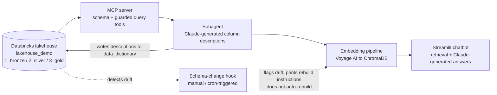
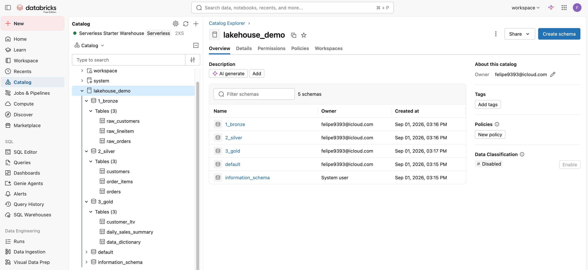
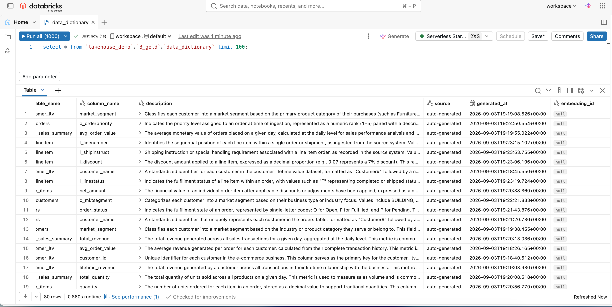

# Medallion Architecture Data Dictionary RAG

An AI + Analytics Engineering integration project: a RAG chatbot that auto-generates and answers questions about a data dictionary over a Databricks Medallion (Bronze/Silver/Gold) lakehouse. A Claude-powered subagent inspects table/column metadata via a custom MCP server and drafts human-readable descriptions, which are embedded with Voyage AI into ChromaDB and served through a Streamlit chatbot that retrieves relevant entries and answers in natural language via the Anthropic API.

## Architecture







- [`mcp_server/`](mcp_server) — MCP server exposing schema inspection and LIMIT-guarded query tools over the lakehouse.
- [`subagents/`](subagents) — Reads table/column metadata via MCP, drafts descriptions with Claude, writes them back to `data_dictionary`.
- [`embeddings/`](embeddings) — Embeds dictionary entries with Voyage AI and indexes them in ChromaDB.
- [`chatbot/`](chatbot) — Streamlit chat UI; retrieves from ChromaDB and answers via the Anthropic API.
- [`hooks/`](hooks) — Schema drift detector.

## Key engineering decisions

- **Layer-aware description generation.** Bronze columns are described as raw, as-ingested data — the prompt explicitly forbids asserting uniqueness, primary-key status, or clean joinability that hasn't been established yet at that layer. Silver/Gold columns get relational language (primary key, join key, etc.) once the data has actually been conformed. ([`subagents/generate_descriptions.py`](subagents/generate_descriptions.py#L81-L91))

- **Programmatic guardrail against LLM fabrication.** Prompt wording alone didn't stop the model from inventing plausible-sounding but unevidenced claims — e.g. calling a plain bronze STRING column "encoded" or "hashed" with no such pattern in the sample values. A banned-phrase filter catches this on bronze string columns and triggers one corrective retry with the offending phrase named explicitly. ([`subagents/generate_descriptions.py`](subagents/generate_descriptions.py#L159-L269))

- **Retrieval-aware answer logic, not "newest layer wins."** When the top two ChromaDB matches are near-tied, the chatbot distinguishes *why* they're tied before deciding how to answer: raw-vs-cleaned pairs (bronze/silver) get a "here's both, but use the cleaned one" answer, while a general column tied with a purpose-built Gold aggregate gets "here's both, scoped differently — you decide," since a Gold aggregate isn't simply a more-refined version of the same thing. ([`chatbot/app.py`](chatbot/app.py#L83-L138))

## Setup

**Prerequisites**
- A Databricks workspace with a Medallion lakehouse (this project targets `lakehouse_demo` on Databricks Free Edition — see [`CLAUDE.md`](CLAUDE.md) for the exact schema/table layout)
- An [Anthropic API key](https://console.anthropic.com/)
- A [Voyage AI API key](https://www.voyageai.com/)

**Install**

```bash
pip install -r requirements.txt
cp .env.example .env   # fill in DATABRICKS_*, ANTHROPIC_API_KEY, VOYAGE_API_KEY
```

**Run, in order**

```bash
python -m subagents.generate_descriptions   # populate data_dictionary descriptions
python -m embeddings.build_index            # embed + index into ChromaDB
streamlit run chatbot/app.py                # launch the chatbot
```

To check for lakehouse schema drift at any point (e.g. via a scheduled task):

```bash
python -m hooks.detect_schema_change
```

## Demo

<video src="docs/medallion-rag-chatbot-demo.mov" controls width="700"></video>

## Tech stack

Python · Databricks SQL · MCP (Model Context Protocol) · Anthropic API · Voyage AI · ChromaDB · Streamlit

## Possible extensions

- **Automate the schema-change hook.** [`hooks/detect_schema_change.py`](hooks/detect_schema_change.py) is built and verified end-to-end against real schema changes (column add + drop), but it's intentionally manual/cron-triggered rather than wired to auto-run `build_index.py` — a deliberate scoping choice for this project rather than a limitation of the detection logic itself.
- Incremental re-embedding (only changed rows) instead of a full rebuild.
- Multi-turn conversational memory in the chatbot (currently each question is answered independently of prior turns' retrieval).
